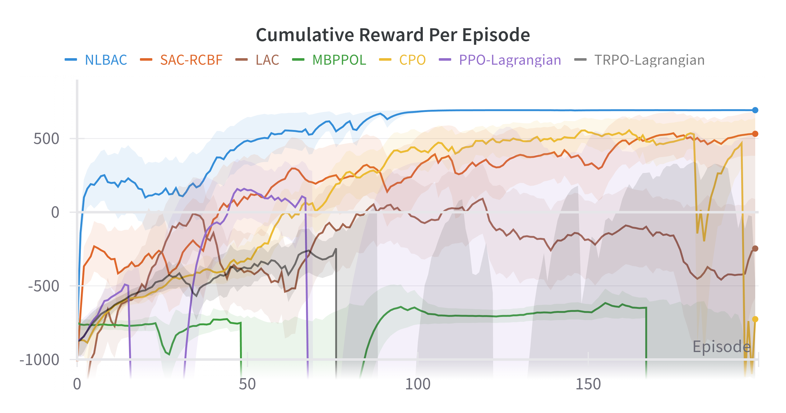
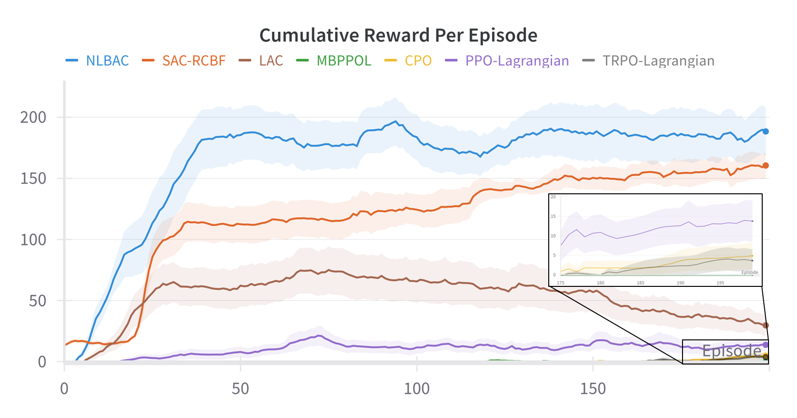
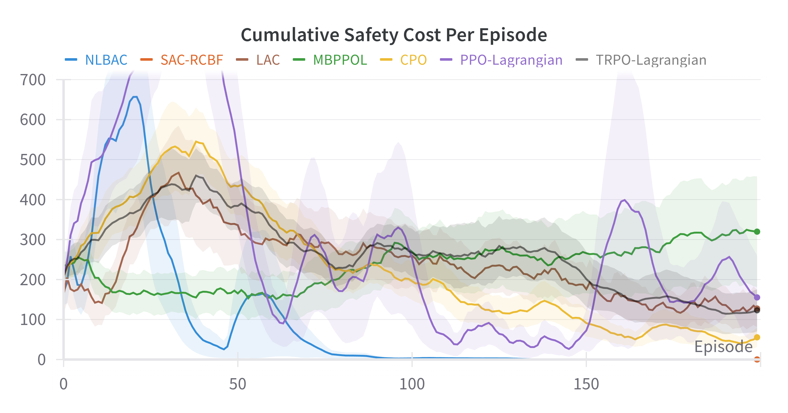
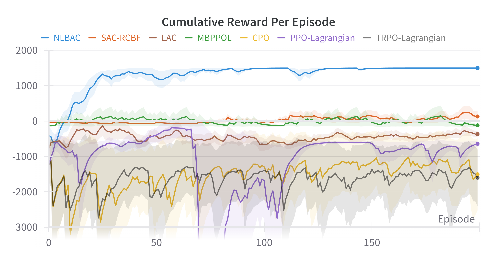
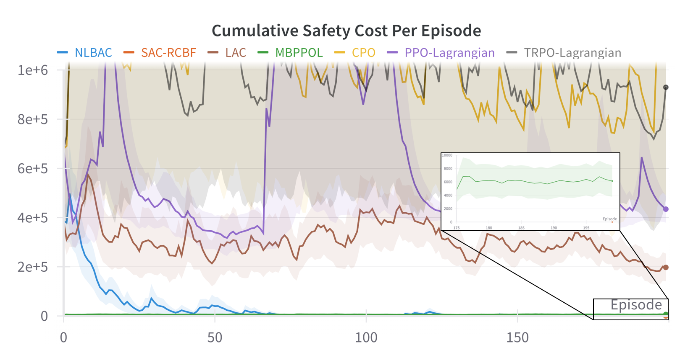
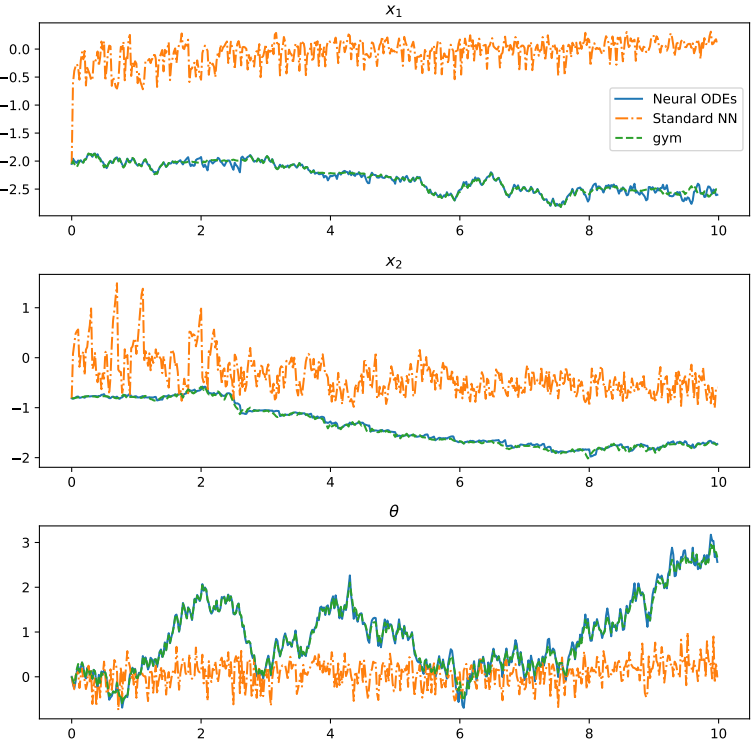
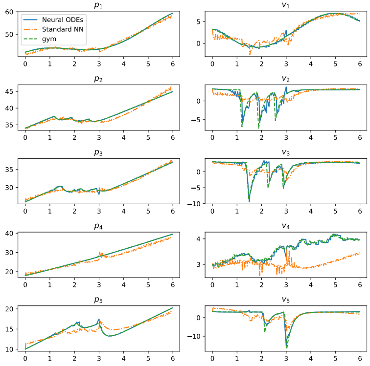
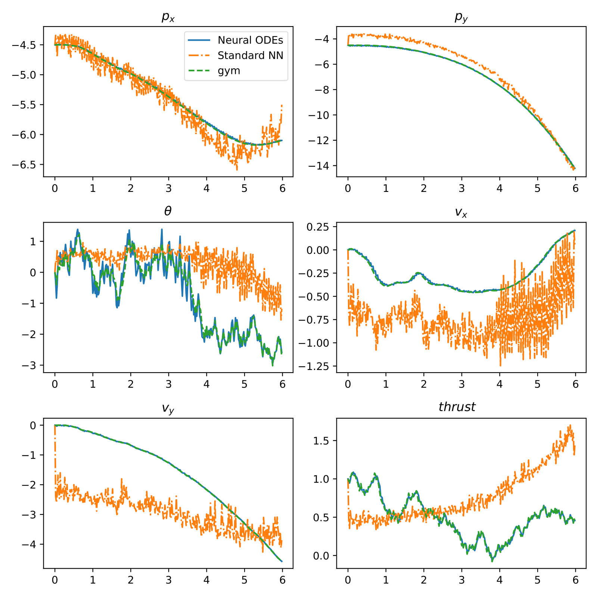
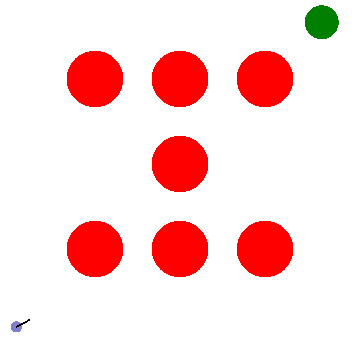

# Neural-ordinary-differential-equations-based-Lyapunov-Barrier-Actor-Critic-NLBAC

Repository containing the code for the paper "NLBAC: A Neural ODE-based Algorithm for State-Wise Stable and Safe Reinforcement Learning through Augmented Lagrangian Method", and this code is developed based on codes: https://github.com/yemam3/Mod-RL-RCBF, and https://github.com/LiqunZhao/A-Barrier-Lyapunov-Actor-Critic-Reinforcement-Learning-Approach-for-Safe-and-Stable-Control for the paper [Stable and Safe Reinforcement Learning via a Barrier-Lyapunov Actor-Critic Approach](https://ieeexplore.ieee.org/abstract/document/10383742).

This repository only contains the code with clear comments for the algorithms ***Neural ordinary differential equations-based Lyapunov Barrier Actor Critic (NLBAC)***, 
for other algorithms, please refer to:

***SAC-RCBF***: https://github.com/yemam3/Mod-RL-RCBF

***MBPPO-Lagrangian***: https://github.com/akjayant/mbppol

***LAC***: https://github.com/hithmh/Actor-critic-with-stability-guarantee

***CPO, PPO-Lagrangian and TRPO-Lagrangian***: https://github.com/openai/safety-starter-agents

Three environments called `Unicycle`, `SimulatedCars (Simulated Car Following)` and `Planar Vertical Take-Off and Landing (PVTOL)` are provided in this repository. In `Unicycle`, a unicycle is required to arrive at the
desired location, i.e., destination, while avoiding collisions with obstacles. `SimulatedCars (Simulated Car Following)` involves a chain of five cars following each other on a straight road. The goal is to control the acceleration of the $4^{th}$ car to keep
a desired distance from the $3^{rd}$ car while avoiding collisions with other cars. In `Planar Vertical Take-Off and Landing (PVTOL)`, a quadcopter is required to reach a destination while avoiding obstacles, keeping within a specified range along the Y-axis and within a specific distance from a safety pilot along the X-axis.

***Detailed descriptions of the three environments can be found in the last part of this page.***

***Interested readers can also explore the option of using their own customized environments. Detailed instructions can be found below***.

## Installation Requirement
The experiments are run with Pytorch, and wandb (https://wandb.ai/site) is used to save the data and draw the graphs. 
To run the experiments, some packages are listed below with their versions (in my conda environment).
```bash
python: 3.6.13
pytorch: 1.10.2 
numpy: 1.17.5
wandb: 0.12.11
gym: 0.15.7
torchdiffeq 0.2.3
```

## Running the Experiments
Firstly, instructions on how to run the codes for the `Unicycle`, `SimulatedCars (Simulated Car Following)` and `Planar Vertical Take-Off and Landing (PVTOL)` environments are provided. Following that, instruction on applying this NLBAC framework to your customized environment is  provided. 

### `Unicycle` Env: 
You can follow the steps below to run the RL-training part directly since a pre-trained model has been provided:
1. Navigate to the directory `Neural-ordinary-differential-equations-based-Lyapunov-Barrier-Actor-Critic-NLBAC/NLBAC_Unicycle_RL_training/Unicycle_RL_training`
2. Run the command `python main.py --env Unicycle --gamma_b 50 --max_episodes 200  --cuda --updates_per_step 2 --batch_size 128 --seed 0  --start_steps 1000`

Here are the results obtained by my machine:
<p align="center">
  
   
</p>

The experiment where neural barrier certificate is trained and used is within the folder `neural_barrier_certificate`.

### `SimulatedCars (Simulated Car Following)` Env: 
You can follow the steps below to run the RL-training part directly since a pre-trained model has been provided:
1. Navigate to the directory `Neural-ordinary-differential-equations-based-Lyapunov-Barrier-Actor-Critic-NLBAC/NLBAC_SimulatedCarsFollowing_RL_training/Simulated_Car_Following_RL_training`
2. Run the command `python main.py --env SimulatedCars --gamma_b 0.5 --max_episodes 200 --cuda --updates_per_step 2 --batch_size 256 --seed 0 --start_steps 200`

Here are the results obtained by my machine:
<p align="center">
  
   
</p>

### `Planar Vertical Take-Off and Landing (PVTOL)` Env: 
You can follow the steps below to run the RL-training part directly since a pre-trained model has been provided:
1. Navigate to the directory `Neural-ordinary-differential-equations-based-Lyapunov-Barrier-Actor-Critic-NLBAC/NLBAC_pvtol_RL_training/Pvtol_RL_training`
2. Run the command `python main.py --env Pvtol --gamma_b 0.8 --max_episodes 400 --cuda --updates_per_step 1 --batch_size 256 --seed 10 --start_steps 1000`

Here are the results obtained by my machine:
<p align="center">
  
   
</p>

The experiment where neural barrier certificate is trained and used is within the folder `neural_barrier_certificate`.
### Adding new environments and running custom experiments: 

The whole process is similar: 

1. Copy the folder `Unicycle` and rename it as your customized environment `Your_customized_environment`
2. Prepare you own customized environment and do some adjustments. Here is one point:
- Outputs of your own customized `env.step` function. Besides `next obs`, `reward`, `done` and `info` that are commonly used in RL literature, here we still need:
  - `constraint`: Difference between the current state and the desired state, and is required to decrease. It is also used to approximate the Lyapunov network.
  - Some lists used as inputs of the Lyapunov network (if `obs` and `next obs` are not used as inputs of the Lyapunov network directly). See the aforementioned environments as examples.
  - Other info like the number of safety violations and value of safety cost (usually used in algorithms like CPO, PPO-Lagrangian and TRPO-Lagrangian), and barrier signal if a neural barrier certificate needs to be learned.
3. Add the new customized environment in the file `build_env.py`, and change some `if` statements regarding `dynamics_mode` in `sac_cbf_clf.py`
4. Change the replay buffer since the outputs of `env.step` are changed.
5. Tune the hyperparameters like batch size, number of hidden states and so on if necessary.
6. Change the input and output dimensions in `Neural-ordinary-differential-equations-based-Lyapunov-Barrier-Actor-Critic-NLBAC/Your_customized_environment/Your_customized_environment_RL_training/sac_cbf_clf/sac_cbf_clf.py`
7. Rewrite the functions `get_policy_loss_2` and `backup_get_policy_loss_2` in the file `Neural-ordinary-differential-equations-based-Lyapunov-Barrier-Actor-Critic-NLBAC/Your_customized_environment/Your_customized_environment_RL_training/sac_cbf_clf/sac_cbf_clf.py` to formulate your own CBF and CLF constraints (either pre-defined CBFs or neural barrier certificate)
8. Navigate to the directory `Neural-ordinary-differential-equations-based-Lyapunov-Barrier-Actor-Critic-NLBAC/Your_customized_environment/Your_customized_environment_RL_training`
9. Change some contents in the file `main.py` like when to use and stop the backup controller according to your customized environment
10. Run the command `python main.py --env Your_customized_environment --gamma_b 0.5 --max_episodes 200 --cuda --updates_per_step 2 --batch_size 256 --seed 0 --start_steps 200`. Change the arguments if necessary.

## Comparisons of Modeling Performance between Neural ODEs and Conventional Neural Network
Here we present comparisons of modeling performance between Neural ODEs, which model system dynamics, and a common neural network baseline that directly outputs the predicted next state.

 **Unicycle:** In this environment, with the prior knowledge that the system is control-affine, we utilize two separate networks to represent $\hat{f}$ and $\hat{g}$, respectively, to model the dynamics through Neural ODEs. For the common neural network baseline, we employ a multilayer perceptron (MLP) with 5 hidden layers, each with a hidden dimension of 100, to predict the next states given the current states and actions. The test result is depicted below, where the mean squared error of the NODEs-based model, computed using the PyTorch `nn.MSELoss` function, is 0.0029, and the mean squared error of the common NN-based model computed in the same way is 2.5176. 
<p align="center">
  
</p>

**Simulated Car Following:** In this environment, lacking the prior knowledge about whether the system is control-affine or not, we directly use a single network to represent $\mathcal{F}$ to model the dynamics through Neural ODEs. For the common neural network baseline, we employ an MLP with 4 hidden layers, each with a hidden dimension of 64, to predict the next states. The test result is illustrated below, where the mean squared error of the NODEs-based model, computed using the PyTorch `nn.MSELoss` function, is 0.3682, and the mean squared error of the common NN-based model computed in the same way is 1.5534. 
<p align="center">
  
</p>

**Planar Vertical Take-Off and Landing (PVTOL):** In this environment, with the prior knowledge that the system is control-affine, we utilize two separate networks to represent $\hat{f}$ and $\hat{g}$, respectively, to model the dynamics through Neural ODEs. For the common neural network baseline, we also employ two separate networks with the same structure as Neural ODEs to predict the next states given the current states and actions. The test result is depicted below, where the mean squared error of the NODEs-based model, computed using the PyTorch `nn.MSELoss` function, is 0.1258, and the mean squared error of the common NN-based model computed in the same way is 2.1180.
<p align="center">
  
</p>


## Detailed Experiment Setup
**Unicycle:** In this experiment setup, a unicycle is tasked with reaching the designated location, i.e., the destination, while avoiding collisions with obstacles. The real dynamics of the system is: 

```math
\dot{x}_{t_k}= 
\begin{bmatrix} 
\cos (\theta_{t_k}) & 0 \\ 
\sin (\theta_{t_k}) & 0 \\ 
0 & 1.0 
\end{bmatrix} (u_{t_k} + u_{d, t_k}). 
```

Here, $x_{t_k} = [x_{1t_k}, x_{2t_k}, \theta_{t_k}]^T$ is the state where $x_{1t_k}$ and $x_{2t_k}$ represent the X-coordinate and Y-coordinate of the unicycle and $\theta_{t_k}$ is the orientation at the timestep $t_k$. The control signal $u_{t_k} = [v_{t_k}, \omega_{t_k}]^T$ comprises linear velocity $v_{t_k}$ and angular velocity $\omega_{t_k}$. The time interval used in this experiment is $0.02$ s. $u_{d, t_k} = -0.1[\cos(\theta_{t_k}), 0]^T$. As to NODE-based models, the input of network $\hat{f}$ is the state with the dimension of 3, and the output dimension is 3; the input of network $\hat{g}$ is the state with the dimension of 3, and the output dimension is 6 (which is then resized as $[3, 2]$). Then, a point at a distance $l_p$ ahead of the unicycle is considered to establish safety constraints for collision-free navigation, and the function $p: \mathbb{R}^3 \rightarrow \mathbb{R}^2$ is defined as: 

```math
p(x_{t_k})= 
\begin{bmatrix} 
x_{1t_k} \\ 
x_{2t_k} 
\end{bmatrix} + l_p 
\begin{bmatrix} 
\cos (\theta_{t_k}) \\ 
\sin (\theta_{t_k}) 
\end{bmatrix}.
```
  
&emsp;&emsp;The reward signal is formulated as $-K_1(v_t - v_s)^2 + K_2 \Delta d$, where $v_s$ represents the predefined velocity, $\Delta d$ denotes the reduction in the distance between the unicycle and the destination in two consecutive timesteps, and $K_1$ and $K_2$ are coefficients set to 0.1 and 30, respectively. An additional reward of 500 will be given if the unicycle reaches a small neighborhood of the destination. The cost signal is given by $\left\lVert p(x_{t_{k+1}}) - p(x_{\text{desired}}) \right\rVert$ where $p(x_{\text{desired}}) = [x_{\text{1desired}}, x_{\text{2desired}}]^T$ denotes the position of the desired location. Pre-defined CBFs, if provided, are $`h_i(x_{t_k}) = \frac{1}{2} \big( (p(x_{t_k}) - p_{\text{obs}_i})^2 - \delta^2 \big)`$ where $p_{\text{obs}_i}$ represents the position of the $i^{th}$ obstacle, and $\delta$ is the minimum required distance between the unicycle and obstacles. Hence, the relative degree is 1 and the planning horizon for NODEs predictions is 1. When no pre-defined CBFs are available, the neural barrier certificate will be learned jointly with the controller by using additional barrier signals with $d = 1$ and $D= -20$.   
  
&emsp;&emsp;If the stability constraint is violated due to the inability to satisfy safety and stability constraints simultaneously, the unicycle can become trapped close to obstacles. In such cases, the backup controller takes over from the primary controller. The primary controller is reinstated when the unicycle moves a long distance away from the trapped position, or when the predefined time threshold for using the backup controller is exceeded.  
<p align="center">
  
<br>
  <b>Unicycle Environment</b>
</p>  

**Simulated Car Following:** This environment simulates a chain of five cars following each other on a straight road. The objective is to control the acceleration of the $4^{th}$ car to maintain a desired distance from the $3^{rd}$ car while avoiding collisions with other cars. The real dynamics of all cars except the $4^{th}$ one is given by: 

```math 
\begin{array}{l} \dot{x}_{t_{k},i}= \left[ \begin{array}{c} v_{t_{k},i} \\ 0 \end{array} \right ] + \left[ \begin{array}{c} 0 \\ 1+d_i \end{array} \right ] a_{t_{k},i} \qquad \forall i \in \{1,2,3,5\}. \end{array} 
``` 

Each state of the system is denoted as $x_{t_{k},i} = [p_{t_{k},i},v_{t_{k},i}]^T$, indicating the position $p_{t_{k},i}$ and velocity $v_{t_{k},i}$ of the $i^{th}$ car at the timestep $t_{k}$, $d_i=0.1$. The time interval used in this experiment is $`0.02s`$. The predefined velocity of the $1^{st}$ car is $v_{s} - 4\sin (t_{k})$, where $v_{s}=3.0$. Its acceleration is given as $a_{t_{k},1}=k_v(v_{s} - 4\sin (t_{k}) -v_{t_{k},1})$ where $k_v=4.0$. Accelerations of Car 2 and 3 are given by: 

```math 
a_{t_{k},i}\!=\!\left\{ \begin{aligned} &\!k_v(v_{s}\!-\!v_{t_{k},i})\!-\!k_b(p_{t_{k},i\!-\!1}\!-\!p_{t_{k},i})\,\,\text{if}\,|p_{t_{k},i\!-\!1}\!-\!p_{t_{k},i}|\! <\! 6.5\\ &\!k_v(v_{s}\!-\!v_{t_{k},i})\,\,\,\,\,\,\,\,\,\,\,\,\,\,\,\,\,\,\,\,\,\,\,\,\,\,\,\,\,\,\,\,\,\,\,\,\,\,\,\,\,\,\,\,\,\text{otherwise}, \\ \end{aligned} \right. 
```

where $k_b=20.0$ and $i=2,3$. The acceleration of the $5^{th}$ car is: 

```math  
a_{t_{k},5}\!=\!\left\{ \begin{aligned} &\!k_v(v_{s}\!-\!v_{t_{k},5})\!-\!k_b(p_{t_{k},3}\!-\!p_{t_{k},5})\,\,if\,|p_{t_{k},3}-p_{t_{k},5}| \!<\! 13.0\\ &\!k_v(v_{s}\!-\!v_{t_{k},5})\,\,\,\,\,\,\,\,\,\,\,\,\,\,\,\,\,\,\,\,\,\,\,\,\,\,\,\,\,\,\,\,\,\,\,\,\,\,\,\,\,\,\,\,\,otherwise. \\ \end{aligned} \right. 
``` 

The model of the $4^{th}$ car is as follows: 
```math
\dot{x}_{t_k,4}= \left[ \begin{array}{c} v_{t_{k},4} \\ 0 \end{array} \right ] + \left[ \begin{array}{c} 0 \\ 1.0 \end{array} \right ] u_{t_{k}} , 
``` 

where $u_{t_{k}}$ is the acceleration of the $4^{th}$ car, and also the control signal generated by the controller at the timestep $t_{k}$.   
  
&emsp;&emsp;The reward signal is defined to minimize the overall control effort, and an additional reward of 2.0 is granted during timesteps when $d_{t_k} = p_{t_k,3}-p_{t_k,4}$, which is the distance between the $3^{rd}$ and $4^{th}$ car, falls within $[9.0,10.0]$. This range is defined as the desired region for $d_{t_k}$. Thus, the cost signal is determined as $\left\lVert d_{t_{k+1}} - d_{\text{desired}} \right\rVert$, where $d_{\text{desired}}=9.5$. Pre-defined CBFs are defined as $h_1(x_{t_k}) = p_{t_{k},3} - p_{t_{k},4} - \delta$ and $h_2(x_{t_k}) = p_{t_{k},4} - p_{t_{k},5} - \delta$, with $\delta$ being the minimum required distance between the cars. Hence, the relative degree is 2 and the planning horizon for making predictions using NODE is 2. 

&emsp;&emsp;Note that when we use NODEs to model this system, we assume that we do not have the priori information that this system is control-affine. The input of network $`\mathcal{F}`$ is $`\left(t_k, \hat{x}_{t_k}, u_{t_k}\right)`$ with the dimension of 12, and the output dimension is 10. When a safety constraint is violated if two types of constraints cannot be satisfied simultaneously, the $4^{th}$ car might be in close proximity to the $5^{th}$ car in order to make $d_{t_k}$ be within $[9.0,10.0]$. In such cases, the backup controller is activated. The primary controller is reactivated when the $4^{th}$ car moves beyond the dangerous area, namely out of the vicinity of the $5^{th}$ car, or when the predetermined time threshold for utilizing the backup controller is exceeded.  
  
**Planar Vertical Take-Off and Landing (PVTOL):** In this experiment, a quadcopter is required to reach a destination while avoiding obstacles and keeping within a specified range along the Y-axis and a specific distance from a safety pilot along the X-axis. The real dynamics of the system is: 

```math
\begin{array}{l} \dot{x}_{t_{k}}= \left[ \begin{array}{c} v_{1{t_k}} \\ v_{2{t_k}}\\ 0\\ - \sin (\theta_{t_k}) \times f_{t_k}\\ \cos (\theta_{t_k}) \times f_{t_k} -1.0\\ 0 \end{array} \right ] + \left[ \begin{array}{cc} 0 & 0\\ 0 & 0\\ 0 & 1\\ 0 & 0\\ 0 & 0\\ 1 & 0 \end{array} \right ] u_{t_{k}} . \end{array} 
``` 

Here $x_{t_k} = [x_{1t_k}, x_{2t_k}, \theta_{t_k}, v_{1{t_k}}, v_{2{t_k}}, f_{t_k}]^T$ is the state where $x_{1t_k}$ and $x_{2t_k}$ represent the X-coordinate and Y-coordinate of the quadcopter and $\theta_{t_k}$ is the orientation at the timestep $t_k$. $v_{1{t_k}}$ and $v_{2{t_k}}$ are velocities along X and Y axis, and $f_{t_k}$ is the thrust. The control signal $u_{t_k} = [u_{ft_k}, \omega_{t_k}]^T$ includes the derivative of the thrust and angular velocity. The time interval used in this experiment is $0.02$ s.   
  
&emsp;&emsp;The reward signal is defined to minimize the distance from the destination, and an additional reward of 1500 will be given if the quadcopter reaches a small neighborhood of the destination. The cost signal is the current distance from the destination, and the safety pilot tracks the quadcopter via a proportional controller along the X-axis. Collision avoidance and confinement within specific ranges along the X-axis and Y-axis are ensured by pre-defined CBFs, following a similar approach to the previous two environments, if given. The relative degree, and therefore the planning horizon for NODEs predictions, is 3. When no pre-defined CBFs are available,  the neural barrier certificate will be learned jointly with the controller by using additional barrier signals with $d = 0.1$ and $D= -0.1$.  
  
 &emsp;&emsp;For NODE-based models, the input of network $\hat{f}$ is the state with the dimension of 6, and the output dimension is 6; the input of network $\hat{g}$ is the state with the dimension of 6, and the output dimension is 12 (which is then resized as $[6, 2]$). The conditions for activating the backup controller resemble those in the previous two tasks.
## Others 
If you have some questions regarding the code or the paper, please do not hesitate to contact me by email. My email address is `liqun.zhao@eng.ox.ac.uk`.
