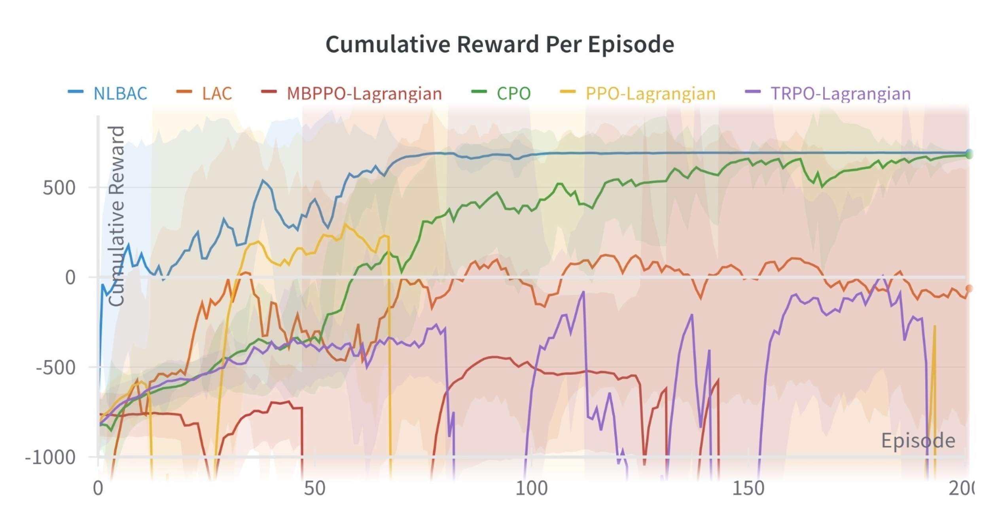
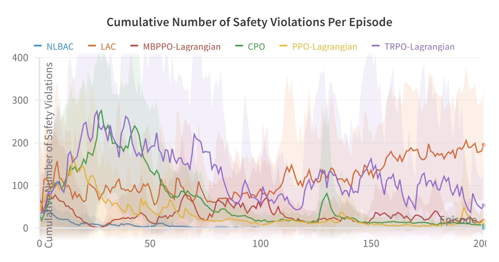
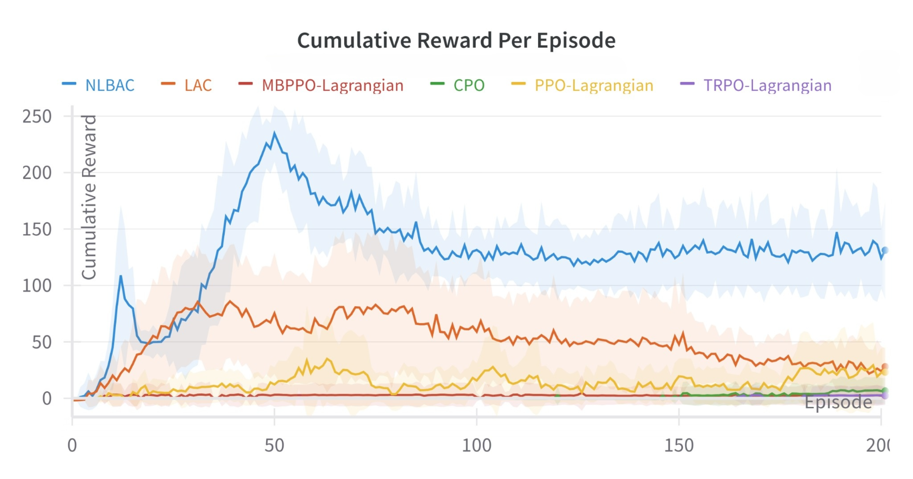
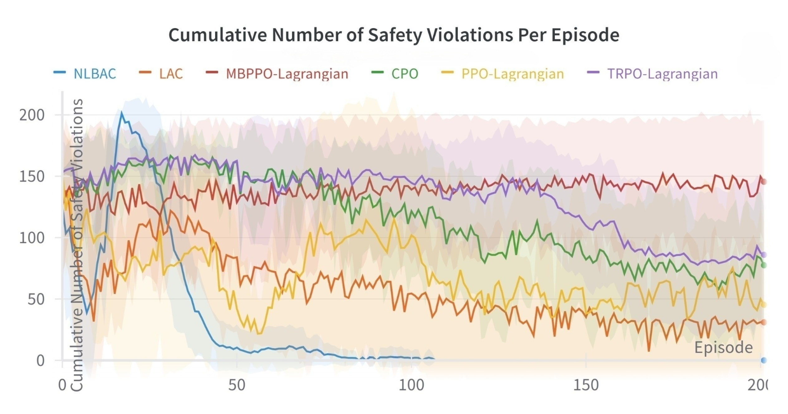

# Neural-ordinary-differential-equations-based-Lyapunov-Barrier-Actor-Critic-NLBAC

Repository containing the code for the paper ["NLBAC: A Neural ODEs-based Framework for Stable and Safe
Reinforcement Learning"](https://github.com/LiqunZhao/Comprehensive-Version-of-Paper-NLBAC/blob/main/NLBAC%3A%20A%20Neural%20ODEs-based%20Framework%20for%20Stable%20and%20Safe%20Reinforcement%20Learning.pdf), and this code is developed based on codes: https://github.com/yemam3/SAC-RCBF, and https://github.com/LiqunZhao/A-Barrier-Lyapunov-Actor-Critic-Reinforcement-Learning-Approach-for-Safe-and-Stable-Control for the paper [Stable and Safe Reinforcement Learning via a Barrier-Lyapunov Actor-Critic Approach](https://ieeexplore.ieee.org/abstract/document/10383742).

This repository only contains the code with clear comments for the algorithms ***Neural ordinary differential equations-based Lyapunov Barrier Actor Critic (NLBAC)***, 
for other algorithms, please refer to:

***MBPPO-Lagrangian***: https://github.com/akjayant/mbppol

***LAC***: https://github.com/hithmh/Actor-critic-with-stability-guarantee

***CPO, PPO-Lagrangian and TRPO-Lagrangian***: https://github.com/openai/safety-starter-agents

Two environments called `Unicycle` and `SimulatedCars` are provided in this repository. In `Unicycle`, a unicycle is required to arrive at the
desired location, i.e., destination, while avoiding collisions with obstacles. `SimulatedCars` involves a chain of five cars following each other on a straight road. The goal is to control the acceleration of the 4th car to keep
a desired distance from the 3rd car while avoiding collisions with other cars.

***Interested readers can also explore the option of using their own customized environments. Detailed instructions can be found below***.

## Installation Requirement
The experiments are run with Pytorch, and wandb (https://wandb.ai/site) is used to save the data and draw the graphs. 
To run the experiments, some packages are listed below with their versions (in my conda environment).
```bash
python: 3.6.13
pytorch: 1.10.2 
numpy: 1.17.5
wandb: 0.12.11
gym: 0.15.7
torchdiffeq 0.2.3
```

## Running the Experiments
Firstly, instructions on how to run the codes for the `Unicycle` and `SimulatedCars` environments are provided. Following that, instruction on applying this NLBAC framework to your customized environment is  provided. 

### `Unicycle` Env: 
You can follow the 3 steps below to run the RL-training part directly since a pre-trained model has been provided:
1. Update the `neural_ode_model_pt` variable in line 130 of `Neural-ordinary-differential-equations-based-Lyapunov-Barrier-Actor-Critic-NLBAC/Unicycle/Unicycle_RL_training/sac_cbf_clf/sac_cbf_clf.py` with the correct path to the provided pre-trained model that aligns with your computing environment
2. Navigate to the directory `Neural-ordinary-differential-equations-based-Lyapunov-Barrier-Actor-Critic-NLBAC/Unicycle/Unicycle_RL_training`
3. Run the command `python main.py --env Unicycle --gamma_b 50 --max_episodes 200  --cuda --updates_per_step 2 --batch_size 128 --seed 0  --start_steps 1000`

If you want to first pre-train a new model and then run the RL-training part, please follow the steps listed below:
1. Navigate to the directory `Neural-ordinary-differential-equations-based-Lyapunov-Barrier-Actor-Critic-NLBAC/Unicycle/Unicycle_modelling`
2. Run the file `Unicycle_modelling.py` (You can first change the names of the data collected and pre-trained model, as well as the path where the pre-trained model is saved in the file. See lines 56, 295, 310, 311. Make sure that they align with each other).
3. Copy the new pre-trained model to `Neural-ordinary-differential-equations-based-Lyapunov-Barrier-Actor-Critic-NLBAC/Unicycle/Unicycle_RL_training/sac_cbf_clf`
4. Update the `neural_ode_model_pt` variable in line 130 of `Neural-ordinary-differential-equations-based-Lyapunov-Barrier-Actor-Critic-NLBAC/Unicycle/Unicycle_RL_training/sac_cbf_clf/sac_cbf_clf.py` with the correct path to the new pre-trained model that aligns with your computing environment
5. Navigate to the directory `Neural-ordinary-differential-equations-based-Lyapunov-Barrier-Actor-Critic-NLBAC/Unicycle/Unicycle_RL_training`
6. Run the command `python main.py --env Unicycle --gamma_b 50 --max_episodes 200  --cuda --updates_per_step 2 --batch_size 128 --seed 0  --start_steps 1000`

Here are the results obtained by my machine:
<p align="center">
  
   
</p>

### `SimulatedCars` Env: 
You can follow the 3 steps below to run the RL-training part directly since a pre-trained model has been provided:
1. Update the `neural_ode_model_pt` variable in line 126 of `Neural-ordinary-differential-equations-based-Lyapunov-Barrier-Actor-Critic-NLBAC/Simulated_Car_Following/Simulated_Car_Following_RL_training/sac_cbf_clf/sac_cbf_clf.py` with the correct path to the provided pre-trained model that aligns with your computing environment
2. Navigate to the directory `Neural-ordinary-differential-equations-based-Lyapunov-Barrier-Actor-Critic-NLBAC/Simulated_Car_Following/Simulated_Car_Following_RL_training`
3. Run the command `python main.py --env SimulatedCars --gamma_b 0.5 --max_episodes 200 --cuda --updates_per_step 2 --batch_size 256 --seed 0 --start_steps 200`

If you want to first pre-train a new model and then run the RL-training part, please follow the steps listed below:
1. Navigate to the directory `Neural-ordinary-differential-equations-based-Lyapunov-Barrier-Actor-Critic-NLBAC/Simulated_Car_Following/Simulated_Car_Following_modelling`
2. Run the file `simulated_cars_following_modelling.py` (You can first change the names of the data collected and pre-trained model, as well as the path where the pre-trained model is saved in the file. See lines 59, 289, 306, 307. Make sure that they align with each other).
3. Copy the new pre-trained model to `Neural-ordinary-differential-equations-based-Lyapunov-Barrier-Actor-Critic-NLBAC/Simulated_Car_Following/Simulated_Car_Following_RL_training/sac_cbf_clf`
4. Update the `neural_ode_model_pt` variable in line 126 of `Neural-ordinary-differential-equations-based-Lyapunov-Barrier-Actor-Critic-NLBAC/Simulated_Car_Following/Simulated_Car_Following_RL_training/sac_cbf_clf/sac_cbf_clf.py` with the correct path to the new pre-trained model that aligns with your computing environment
5. Navigate to the directory `Neural-ordinary-differential-equations-based-Lyapunov-Barrier-Actor-Critic-NLBAC/Simulated_Car_Following/Simulated_Car_Following_RL_training`
6. Run the command `python main.py --env SimulatedCars --gamma_b 0.5 --max_episodes 200 --cuda --updates_per_step 2 --batch_size 256 --seed 0 --start_steps 200`

Here are the results obtained by my machine:
<p align="center">
  
   
</p>

### Adding new environments and running custom experiments: 

The whole process is similar: 

1. Copy the folder `Unicycle` and rename it as your customized environment `Your_customized_environment`
2. Prepare you own customized environment and do some adjustments. Here is one point:
- Outputs of your own customized `env.step` function. Besides `next obs`, `reward`, `done` and `info` that are commonly used in RL literature, here we still need:
  - `constraint`: Difference between the current state and the desired state, and is required to decrease. It is also used to approximate the Lyapunov network.
  - Some lists used as inputs of the Lyapunov network (if `obs` and `next obs` are not used as inputs of the Lyapunov network directly). See the aforementioned environments as examples.
  - Other info like the number of safety violations and value of safety cost (usually used in algorithms like CPO, PPO-Lagrangian and TRPO-Lagrangian) 
3. Add the new customized environment in the file `build_env.py`, and change some if statements regarding `dynamics_mode` in `sac_cbf_clf.py`
4. Change the replay buffer since the outputs of `env.step` are changed.
5. Tune the hyperparameters like learning rates, batch size, number of hidden states and so on if necessary.
6. Navigate to the directory `Neural-ordinary-differential-equations-based-Lyapunov-Barrier-Actor-Critic-NLBAC/Your_customized_environment/Your_customized_environment_modelling`
7. Run the file `Your_customized_environment_modelling.py` (You can change the names of the data collected and pre-trained model, the path where the pre-trained model is saved, and some parameters like the input and output dimensions and the amount of data collected for pre-training. Make sure that they align with each other).
8. Copy the new pre-trained model to `Neural-ordinary-differential-equations-based-Lyapunov-Barrier-Actor-Critic-NLBAC/Your_customized_environment/Your_customized_environment_RL_training/sac_cbf_clf`
9. Update the `neural_ode_model_pt` variable in `Neural-ordinary-differential-equations-based-Lyapunov-Barrier-Actor-Critic-NLBAC/Your_customized_environment/Your_customized_environment_RL_training/sac_cbf_clf/sac_cbf_clf.py` with the correct path to the new pre-trained model that aligns with your computing environment
10. Navigate to the directory `Neural-ordinary-differential-equations-based-Lyapunov-Barrier-Actor-Critic-NLBAC/Your_customized_environment/Your_customized_environment_RL_training`
11. Run the command `python main.py --env Your_customized_environment --gamma_b 0.5 --max_episodes 200 --cuda --updates_per_step 2 --batch_size 256 --seed 0 --start_steps 200`. Change the arguments if necessary.


## Others 
If you have some questions regarding the code or the paper, please do not hesitate to contact me by email. My email address is `liqun.zhao@eng.ox.ac.uk`.
